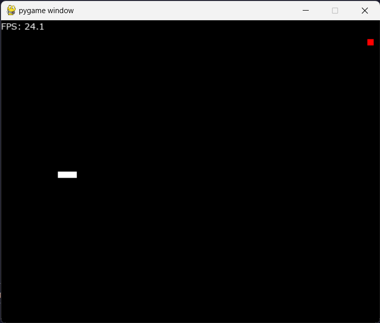

# Snake Game in Python

A snake game written in python using pygame. 

## Why build a Snake Game ?

- To have some experience to build python project.
- To have some experience in basic game development.
- To implement an AI to play snake game in future. 

## The Game

## References

- [ PyGame](https://www.pygame.org/docs/)